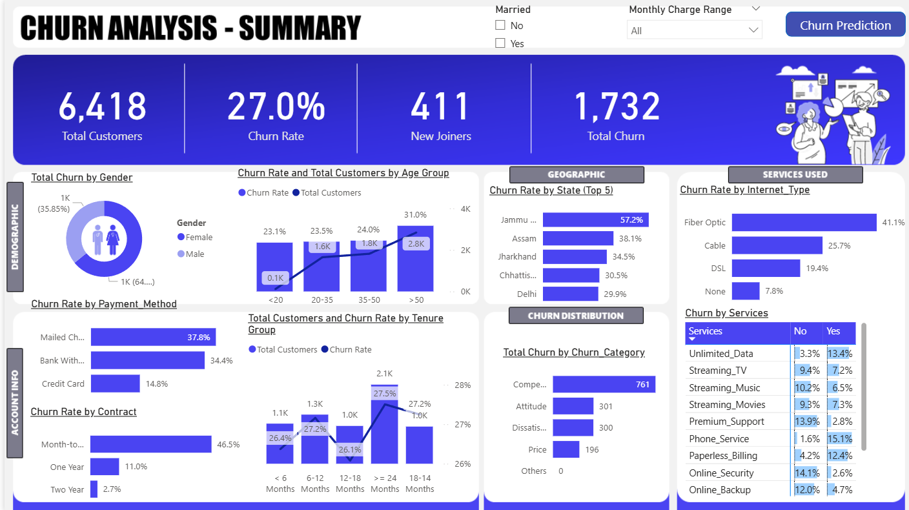
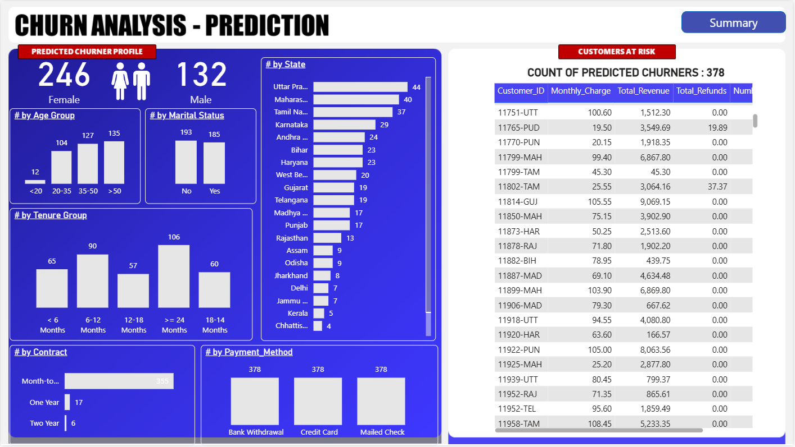
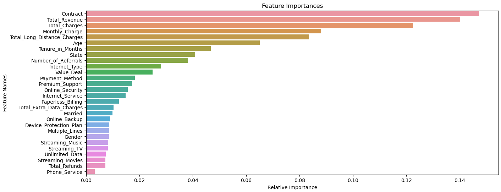

# 📊 Churn Analysis Project

## 📝 Introduction

In today's competitive business environment, retaining customers is essential for long-term success. Churn analysis helps businesses understand customer attrition by analyzing behavioral patterns and identifying factors leading to customer departures. With advanced data analytics and machine learning techniques, this project aims to predict customer churn and empower companies to take proactive measures to improve satisfaction and loyalty.

## 🎯 Project Goals

This end-to-end project combines ETL processing, data visualization, and machine learning to achieve the following:

- Load and cleanse customer data using SQL Server.
- Visualize customer information in Power BI across:
  - Demographic
  - Geographic
  - Payment & Account Info
  - Services
- Identify churn profiles for marketing targeting.
- Develop a predictive model to anticipate future churn.

## 📈 Key Metrics

- Total Customers
- Total Churn & Churn Rate
- New Customer Joiners

---

## 🛠️ Project Workflow

### STEP 1 – ETL Process (SQL Server)
- Load source data into SQL Server.
- Data exploration:
  - Check distinct values.
  - Identify and handle nulls.
- Insert cleaned data into production tables.
- Create views for Power BI integration.

### STEP 2 – Power BI Transform
- Load SQL views into Power BI.
- Perform data shaping and filtering.

### STEP 3 – Power BI Measures
- Define custom DAX metrics:
  - Churn Rate
  - Customer Lifetime
  - Service Tenure

### STEP 4 – Power BI Visualization
- Build interactive dashboard to highlight churn insights.
- Visual segments by customer attributes.

### STEP 5 – Churn Prediction (Machine Learning)
- Use **Random Forest Classifier** to predict churn.
- Tools and libraries:
  - `pandas`, `numpy`, `matplotlib`, `seaborn`
  - `scikit-learn`, `joblib`

### STEP 6 – Visualization of Predictions
- Import ML prediction results into Power BI (via CSV or SQL).
- Analyze patterns and visualize future churn likelihood.

---

## 📦 Files Included

- `Churn Analysis.pbix` – Final Power BI dashboard.
- `SQLQuery.sql` – SQL scripts for ETL and view creation.
- `Churn Prediction.ipynb` – Jupyter notebook for churn prediction.
- `predictions.csv` – Output of the ML model used in Power BI.

## 🚀 Getting Started

1. Clone this repo.
2. Restore SQL database and run `SQLQuery.sql`.
3. Open `Churn Analysis.pbix` and connect to your SQL Server.
4. Run the ML notebook to generate predictions.
5. Load prediction CSV into Power BI.

---

## 📸 Dashboard Overview

## 🔍 Churn Prediction Visualization

## 💬 Feedback

Feel free to fork this repository or submit issues and enhancements. Contributions are welcome!

---

## 📚 License

This project is open-source under the MIT License.
